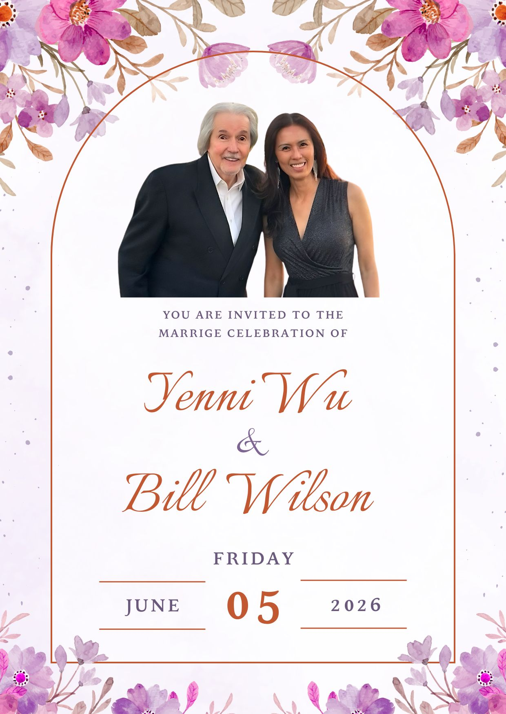
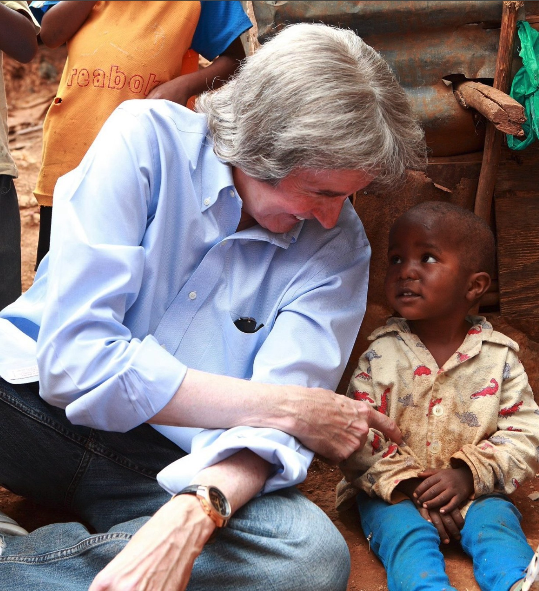

<!DOCTYPE html>
<html lang="en">
<head>
    <meta charset="UTF-8">
    <meta name="viewport" content="width=device-width, initial-scale=1.0">
    
    <title>Yenni & Bill Wedding Invitation</title>

    <meta property="og:title" content="Our Wedding Day | Yenni & Bill">
    <meta property="og:description" content="We are getting married! Click to view our invitation and RSVP.">
    <meta property="og:image" content="BillWilson.jpg">
    <meta property="og:type" content="website">

    <link href="https://fonts.googleapis.com/css2?family=Great+Vibes&family=Playfair+Display:ital,wght@0,400;0,700;1,400&family=Lato:wght@300;400&display=swap" rel="stylesheet">

    
</head>
<body>

    

        

        

            <h2 style="font-style: italic; text-transform: none;">Wedding Invitation</h2>
            
We joyfully invite you to celebrate the marriage of

            
Yenni Wu & Bill Wilson

        

        

        

            <h2>Location & Directions</h2>
            
<strong>Ceremony (2:00 PM)</strong> New Life Tondo

            <a href="https://maps.app.goo.gl/YourMapLink1" target="_blank" class="btn">Open Maps</a>
            
            

            
            
<strong>Reception (6:00 PM)</strong> The Heritage Hotel Manila

            <a href="https://maps.app.goo.gl/YourMapLink2" target="_blank" class="btn">Open Maps</a>
        

        

            

                

                

                

                

                

                

                

                

                

                

                

                
                

                

                

                

                

                

                

                

                

                

                

            

        

        

            <h2>RSVP</h2>
            
Please kindly respond by clicking the button below. We look forward to seeing you!

            <a href="https://forms.gle/vtsvyGpvdMXDehzh9" target="_blank" class="rsvp-btn">Confirm Attendance</a>
        

        

            
With Love, Yenni & Bill

        

    

</body>
</html>
