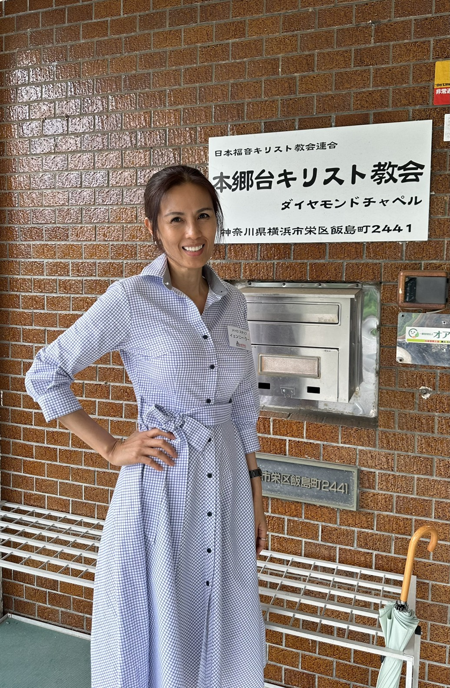
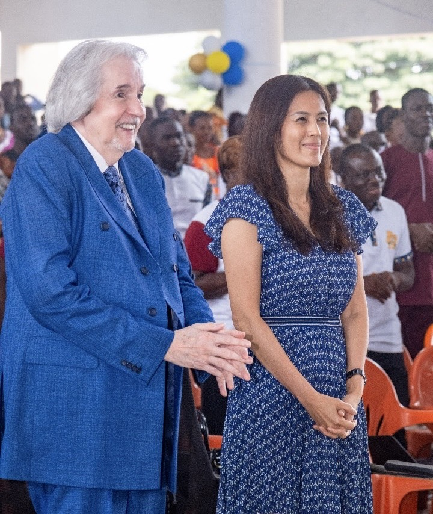
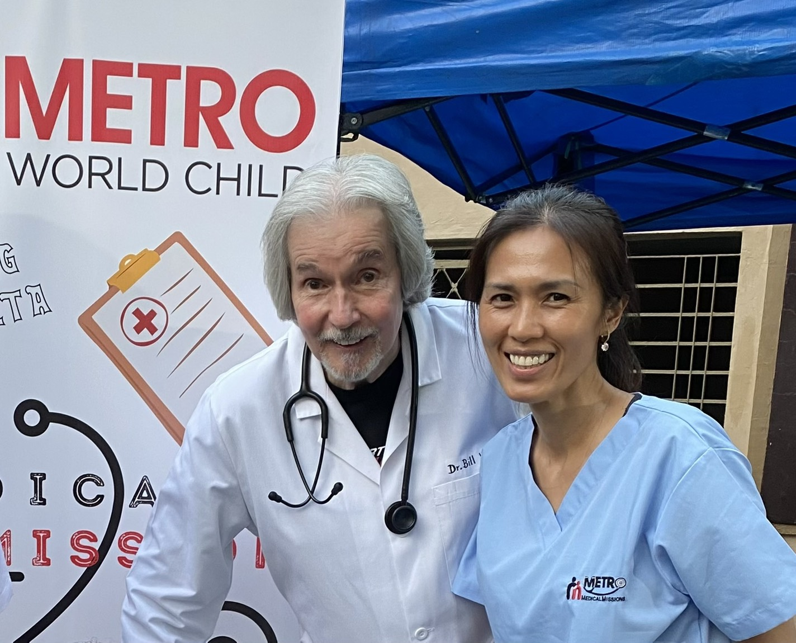
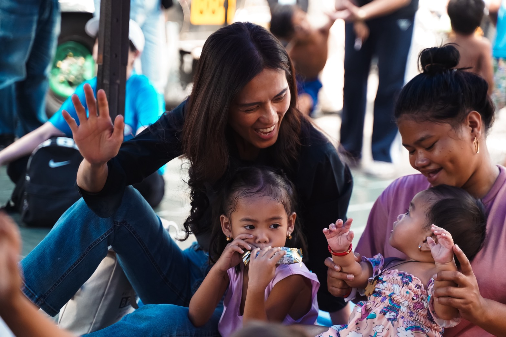
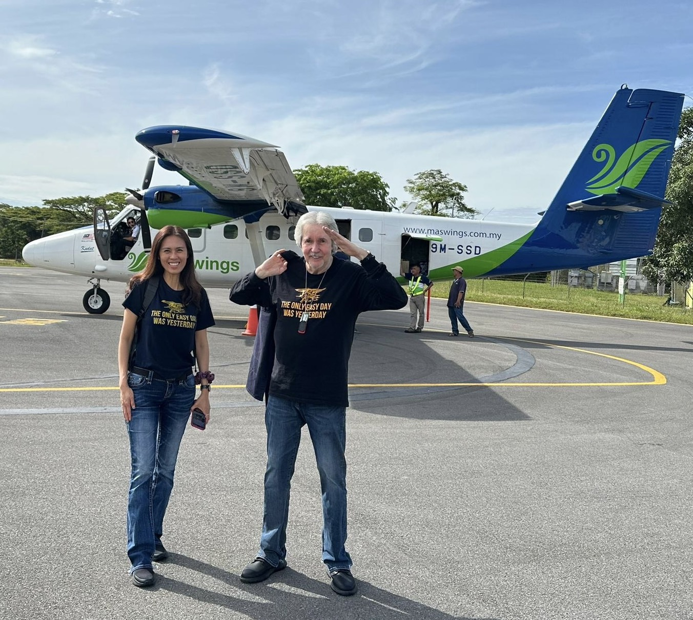
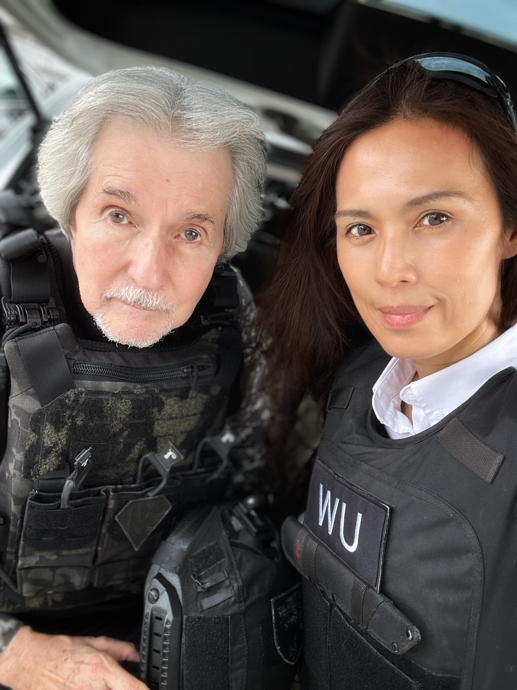
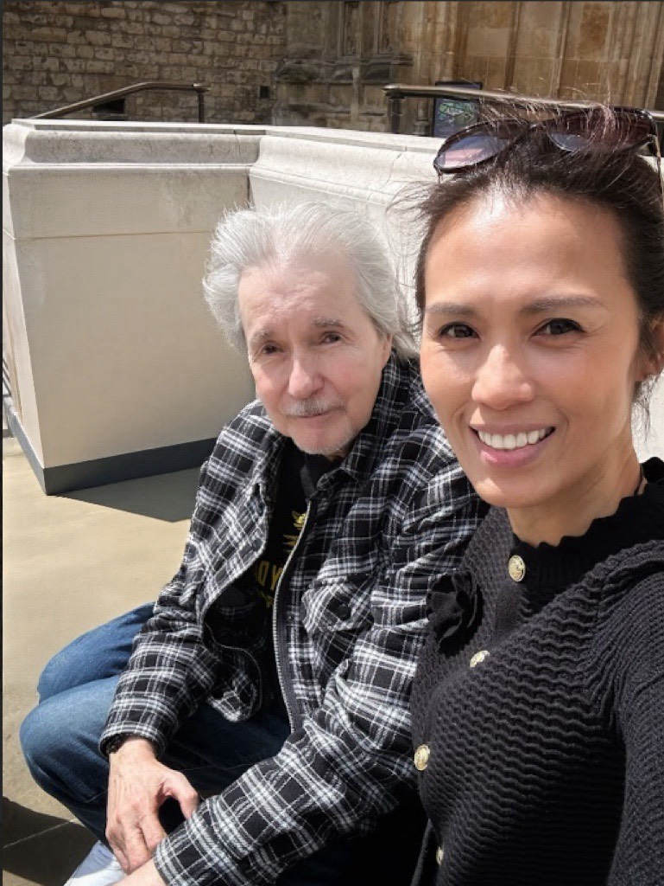
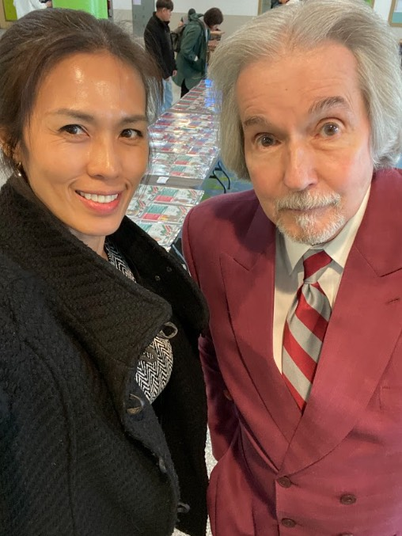

[index.html](https://github.com/user-attachments/files/26925019/index.html)[<!DOCTYPE html>
<html lang="en">
<head>
    <meta charset="UTF-8">
    <meta name="viewport" content="width=device-width, initial-scale=1.0">
    <title>Wedding Invitation | Yenni & Bill</title>
    
</head>
<body>

    

        
 alt="Invitation Cover" class="invite-img">

        

            <h2 style="font-style: italic;">Wedding Invitation</h2>
            
We joyfully invite you to celebrate the marriage of

            
Yenni Wu & Bill Wilson

        

        

        

            <h2>Location & Directions</h2>
            
<strong>Ceremony (2:00 PM)</strong> New Life Tondo

            <a href="https://www.google.com/maps/search/?api=1&query=New+Life+Tondo" target="_blank" class="btn">Open Maps</a>
            
            

            
            
<strong>Reception (6:00 PM)</strong> The Heritage Hotel Manila

            <a href="https://www.google.com/maps/search/?api=1&query=The+Heritage+Hotel+Manila" target="_blank" class="btn">Open Maps</a>
        

        

            

                

                

                

                

                

                

                

                

                

                

                
                

                

                

                

                

                

                

                

                

                

            

        

        

            <h2>RSVP</h2>
            
Please kindly respond by clicking the button below. We look forward to seeing you!

            <a href="https://forms.gle/vtsvyGpvdMXDehzh9" target="_blank" class="rsvp-btn">Confirm Attendance</a>
        

        

            
With Love, Yenni & Bill

        

    

</body>
</html>Uploading index.html…]()
